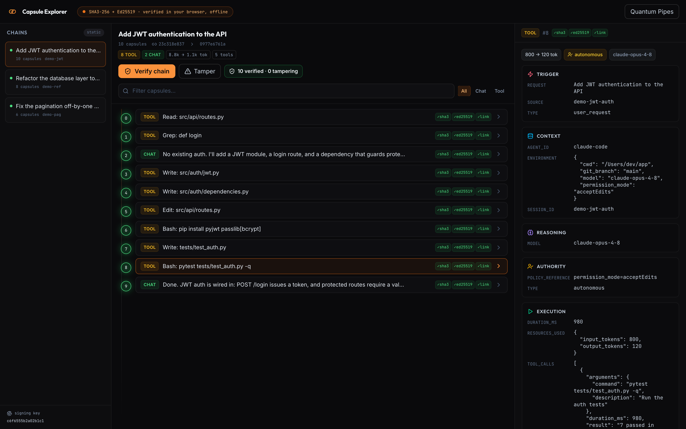

<div align="center">

# 🔐 claude-capsule

### Cryptographic receipts for everything your AI coding agent does.

Every Claude Code session, sealed into a **tamper-evident hashchain** you can verify yourself: in your browser, offline, with nothing to trust but the math.

[](LICENSE)
[](https://docs.claude.com/en/docs/claude-code)
[](pyproject.toml)
[](docs/wire-format.md)
[](explorer/)
[](pyproject.toml)

<br>



<sub>The Capsule Explorer re-verifying a real session in the browser. Every capsule's hash, signature, and chain link, checked client-side. No backend.</sub>

</div>

---

Your AI agent edits files, runs commands, and makes decisions in your repo, often with permissions to act on its own. A chat log of that is just editable text: anyone can quietly change it later and you would never know.

**claude-capsule turns each session into a signed, linked chain of records.** Change one byte of what the AI "did" after the fact, and verification breaks at the exact spot. It is the difference between *remembering* what happened and being able to *prove* it.

```console
# Every session becomes a chain. Verify the whole thing, signatures and all:
$ claude-capsule verify ~/.claude-capsule/chains/today.db --signatures
[OK] today.db: 128/128 verified (head 9c8ec07009b2d759)

# Now edit one byte of what the AI did, and the chain tells on you,
# at the exact record where the tampering happened:
$ claude-capsule verify ~/.claude-capsule/chains/today.db --signatures
[BROKEN] today.db: 41/128 verified (broken at seq 41: content hash mismatch at 41)
```

That second line is the whole point. You cannot rewrite history without leaving a mark.

---

## Install in 30 seconds

Paste this into a Claude Code session and it does everything (installs, wires the hooks, verifies itself):

```text
Install claude-capsule by fetching and following every step in
https://raw.githubusercontent.com/quantumpipes/claude-capsule/main/INSTALL.md
then confirm the hooks are registered.
```

<details>
<summary><b>Prefer to do it yourself?</b> (one command)</summary>

```bash
pipx install git+https://github.com/quantumpipes/claude-capsule
curl -fsSL https://raw.githubusercontent.com/quantumpipes/claude-capsule/main/install.sh | bash
```

`install.sh` registers the `Stop` and `SessionEnd` hooks in `~/.claude/settings.json`
idempotently, without touching hooks you already have. Full detail in [INSTALL.md](INSTALL.md).

</details>

From that moment on, every Claude Code session appends to a chain at `~/.claude-capsule/chains/<session>.db`. You do nothing else. It runs on session stop, stays out of your way, and is fail-open: if anything goes wrong it logs and exits cleanly, so it can never block or slow a session.

---

## How it works

One **capsule** is recorded per action: each tool call, each response, each attachment. A capsule answers six questions about that action (what triggered it, the context, the reasoning, who authorized it, what executed, the outcome), then it is hashed, signed, and linked to the one before it.

```
    prompt            tool call          tool call          response
 ┌────────────┐    ┌────────────┐    ┌────────────┐    ┌────────────┐
 │  seq 0     │──▶ │  seq 1     │──▶ │  seq 2     │──▶ │  seq 3     │──▶ ...
 │  hash ab12 │    │  prev ab12 │    │  prev cd34 │    │  prev ef56 │
 │  signed    │    │  signed    │    │  signed    │    │  signed    │
 └────────────┘    └────────────┘    └────────────┘    └────────────┘

   Each capsule stores the previous one's hash, so changing any capsule
   changes its own hash and breaks every link after it.
```

Three primitives, no magic:

| Step | Mechanism |
|------|-----------|
| **Hash** | `SHA3-256` over the capsule's canonical JSON (the exact bytes are pinned, see [wire-format](docs/wire-format.md)) |
| **Sign** | `Ed25519` signature over that hash, with a key generated on first use at `~/.claude-capsule/key` (`0600`, never leaves your machine) |
| **Chain** | each capsule stores the previous capsule's hash + a sequence number, so the records form one unbroken line |

Verification re-derives the hash from the content, checks the signature against the public key, and checks the links. The Python CLI does it. The browser explorer does it. They agree byte for byte.

> **Why a chain and not just signatures?** A signature proves one record is authentic. A *chain* proves the whole *history* is intact: you cannot delete, reorder, or insert a record in the middle without breaking every link downstream. Tamper evidence for the timeline, not just the entries.

---

## See it: verify in your browser, offline

The companion **Capsule Explorer** is a static site that re-verifies your chains entirely client-side. It recomputes every SHA3-256 hash and checks every Ed25519 signature with audited [`@noble`](https://github.com/paulmillr/noble-hashes) libraries. No backend. No network. No account. Just open it and watch the green checkmarks land.

```bash
git clone https://github.com/quantumpipes/claude-capsule
cd claude-capsule/explorer
npm install && npm run export && npm run dev   # http://localhost:4840
```

<div align="center">


<sub>Verify the chain (every check turns green), then tamper with one capsule. Verification breaks at the exact record, and at every link after it.</sub>

</div>

There is a **tamper test** built in: flip a byte and the explorer scrolls straight to the break. Hand someone your chain JSON plus the public key and they can verify it with the explorer or any SHA3-256 + Ed25519 implementation on earth. You are never asking anyone to trust you. You are handing them the proof.

---

## What gets captured

Per action, in full fidelity:

- **The prompt** that drove it and **the visible response**
- **The tool call**: name, full arguments, result, success/failure, duration
- **Token usage**, the **permission mode** (so you can see when the agent acted autonomously vs. with approval), and per-record provenance (cwd, git branch, model, timestamps)
- **Proof of reasoning.** Claude Code redacts extended-thinking text from the stored transcript (only a cryptographic signature survives), so claude-capsule carries those *thinking signatures* forward as evidence the model reasoned, with a `thinking_redacted` flag. The honest thing: it records what the platform exposes, and marks what it cannot.

---

## Who this is for

| You are... | What you get |
|------------|--------------|
| 🏛️ **In a regulated or audited shop** (finance, health, gov, defense) | A signed, timestamped record of every AI action, ready for review |
| 🤖 **Running agents with elevated permissions** (`acceptEdits`, `bypassPermissions`) | Proof of exactly what the agent did while acting on its own |
| 🔍 **Doing incident or code review** | "Did the AI actually run that command?" answered with a hash, not a hunch |
| 🛡️ **Security-minded, or just curious** | A real cryptographic chain over your own work that you can break, verify, and show off |

If you have ever wanted a *receipt* for what your AI did, this is that.

---

## Command line

```bash
claude-capsule verify  <chain.db> [--signatures]            # recompute hashes + links (+ signatures)
claude-capsule inspect <chain.db> [--seq N]                 # list capsules, or print one in full
claude-capsule export  --out DIR [--db PATH] [--glob PAT]   # write the explorer's JSON bundle
```

```console
$ claude-capsule inspect ~/.claude-capsule/chains/today.db
#  0 tool    bd7b9cc27654 add a hello function to greet.py
#  1 tool    e37d8433f0bf add a hello function to greet.py
#  2 chat    9023e5ba02a9 add a hello function to greet.py
```

Want to try the whole loop right now without a real session? The [`examples/`](examples/) folder ships a synthetic transcript and a five-line walkthrough.

---

## Storage and privacy

| | |
|---|---|
| **Default** | one SQLite file per session at `~/.claude-capsule/chains/<session>.db` (one independent chain each) |
| **Shared** | set `CLAUDE_CAPSULE_DB=~/.claude-capsule/all.db` for a single file, chains grouped by session |
| **Your key** | `~/.claude-capsule/key`, generated on first use, `0600`, stays local. Only the **public** key is shared, so anyone can verify and no one can forge. |
| **Network** | none. No telemetry, no account, no calls out. Your session history is yours. |

See [SECURITY.md](SECURITY.md) for the full trust model (tamper *evidence*, what the key protects, and how to share a chain safely).

---

## FAQ

<details>
<summary><b>Does this capture my private extended thinking?</b></summary>

No. Claude Code strips extended-thinking text from the stored transcript before any hook sees it; only a cryptographic signature remains. claude-capsule records those signatures as proof the model reasoned, plus a `thinking_redacted` flag. Your visible responses are captured in full.
</details>

<details>
<summary><b>Will it slow down or break my sessions?</b></summary>

No. It runs on `Stop`/`SessionEnd`, does bounded work, and is fail-open: any error is logged to `~/.claude-capsule/hook.log` and the process exits 0. An audit tool must never be able to break the thing it audits.
</details>

<details>
<summary><b>Can I verify a chain without trusting this tool?</b></summary>

Yes, that is the entire design. The format is open: SHA3-256 + Ed25519 over canonical JSON ([docs/wire-format.md](docs/wire-format.md)). The browser verifier uses only audited MIT-licensed `@noble` libraries. Re-implement it in any language and you will get the same answer.
</details>

<details>
<summary><b>Is anything sent anywhere?</b></summary>

Never. Everything is local SQLite files and a static site. There is no server to send to.
</details>

---

## Documentation

| Doc | What's inside |
|-----|---------------|
| 📦 [INSTALL.md](INSTALL.md) | The full install guide (and what the paste prompt runs) |
| 🧬 [docs/wire-format.md](docs/wire-format.md) | The exact bytes: canonical JSON, hashing, the signature scheme |
| 🏗️ [docs/architecture.md](docs/architecture.md) | How the hook, chain, and explorer fit together |
| 🛡️ [SECURITY.md](SECURITY.md) | The trust model and key handling |
| 🧪 [examples/](examples/) | A synthetic session you can seal and verify in a minute |

---

## License

[Apache License 2.0](LICENSE). Copyright 2026 Quantum Pipes Technologies, LLC. Built for the [Claude Code](https://docs.claude.com/en/docs/claude-code) community.

<div align="center">

**If a tamper-evident record of your AI's work sounds useful, [star the repo](https://github.com/quantumpipes/claude-capsule) and seal your next session.**

</div>
