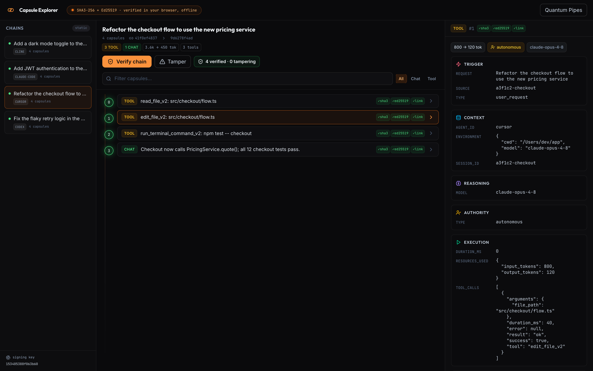
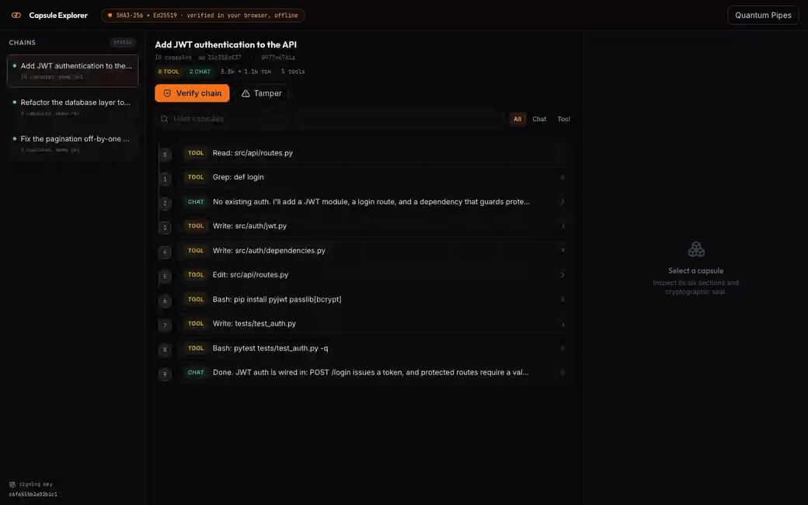

<div align="center">

# 🔐 agent-capsule

### Cryptographic receipts for everything your AI coding agents do.

One tool that seals **Claude Code, Cursor, Codex, and Cline** sessions into **tamper-evident hashchains** you can verify yourself: in your browser, offline, with nothing to trust but the math.

[](LICENSE)
[](docs/tools/claude-code.md)
[](docs/tools/cursor.md)
[](docs/tools/codex.md)
[](docs/tools/cline.md)
[](docs/wire-format.md)
[](pyproject.toml)

<br>



<sub>One explorer, every agent. Sessions from Claude Code, Cursor, Codex, and Cline, re-verified in the browser, offline.</sub>

</div>

---

Your AI agents edit files, run commands, and make decisions in your repo, often with permission to act on their own. A chat log of that is just editable text: anyone can quietly change it later and you would never know.

**agent-capsule turns each session into a signed, linked chain of records.** Change one byte of what the agent "did" after the fact, and verification breaks at the exact spot. It is the difference between *remembering* what happened and being able to *prove* it.

```console
# Every session becomes a chain. Verify the whole thing, signatures and all:
$ agent-capsule verify ~/.agent-capsule/chains/cursor/a3f1c2-checkout.db --signatures
[OK] a3f1c2-checkout.db: 64/64 verified (head 9c8ec07009b2d759)

# Now edit one byte of what the agent did, and the chain tells on you,
# at the exact record where the tampering happened:
$ agent-capsule verify ~/.agent-capsule/chains/cursor/a3f1c2-checkout.db --signatures
[BROKEN] a3f1c2-checkout.db: 18/64 verified (broken at seq 18: content hash mismatch at 18)
```

That second line is the whole point. You cannot rewrite history without leaving a mark, no matter which agent wrote it.

---

## Install: paste this to your agent

Paste this into a session with **any** supported agent (Claude Code, Cursor, Codex, or Cline):

```text
Install agent-capsule so all my coding sessions, from now on, are sealed into a tamper-evident audit trail.
Fetch https://raw.githubusercontent.com/quantumpipes/agent-capsule/main/INSTALL.md and do
every step for whichever agent you are, then confirm the hook is registered.
```

Prefer to do it by hand? See [Manual install](#manual-install) below.

---

## Supported tools

| Tool | Trigger it uses | Install |
|------|-----------------|---------|
| **Claude Code** | `Stop` / `SessionEnd` hooks | `agent-capsule install claude-code` |
| **Cursor** | `~/.cursor/hooks.json` `stop` hook (+ globalStorage enrichment) | `agent-capsule install cursor` |
| **Codex** | `~/.codex/config.toml` `notify` program (per turn) | `agent-capsule install codex` |
| **Cline** | `~/Documents/Cline/Hooks/{TaskComplete,TaskCancel,TaskStart}` | `agent-capsule install cline` |

Each has a one-page guide in [`docs/tools/`](docs/tools/) with the exact trigger, what it captures, and its caveats.

---

## Manual install

```bash
# 1. Install the package (Python 3.11+; only runtime dep is PyNaCl)
pipx install git+https://github.com/quantumpipes/agent-capsule
# or: python3 -m pip install --user git+https://github.com/quantumpipes/agent-capsule

# 2. Wire up whichever agents you use (idempotent; never clobbers existing config)
agent-capsule install claude-code
agent-capsule install cursor
agent-capsule install codex
agent-capsule install cline
```

For Claude Code you can also paste one prompt and let the agent do it. See [INSTALL.md](INSTALL.md).

From then on, every session appends to a chain at `~/.agent-capsule/chains/<tool>/<session>.db`. You do nothing else. Adapters are **fail-open**: if anything goes wrong they log and exit cleanly, so they can never block or slow an agent.

---

## How it works

One **capsule** is recorded per action: each tool call, each response. A capsule answers six questions about that action (what triggered it, the context, the reasoning, who authorized it, what executed, the outcome), then it is hashed, signed, and linked to the one before it.

```
    prompt            tool call          tool call          response
 ┌────────────┐    ┌────────────┐    ┌────────────┐    ┌────────────┐
 │  seq 0     │──▶ │  seq 1     │──▶ │  seq 2     │──▶ │  seq 3     │──▶ ...
 │  hash ab12 │    │  prev ab12 │    │  prev cd34 │    │  prev ef56 │
 │  signed    │    │  signed    │    │  signed    │    │  signed    │
 └────────────┘    └────────────┘    └────────────┘    └────────────┘

   Each capsule stores the previous one's hash, so changing any capsule
   changes its own hash and breaks every link after it.
```

Three primitives, no magic, identical for every tool:

| Step | Mechanism |
|------|-----------|
| **Hash** | `SHA3-256` over the capsule's canonical JSON (the exact bytes are pinned, see [wire-format](docs/wire-format.md)) |
| **Sign** | `Ed25519` signature over that hash, with one key at `~/.agent-capsule/key` (`0600`, never leaves your machine) |
| **Chain** | each capsule stores the previous capsule's hash + a sequence number, so the records form one unbroken line |

The design is one shared **engine** (`agent_capsule.core`) plus a thin **adapter** per tool (`agent_capsule.adapters`). An adapter knows only two things: the tool's trigger, and how to read its transcript. The sealing, hashing, chaining, and verification are shared, so every tool produces the same kind of chain and the same explorer verifies all of them. See [docs/architecture.md](docs/architecture.md).

> **Why a chain and not just signatures?** A signature proves one record is authentic. A *chain* proves the whole *history* is intact: you cannot delete, reorder, or insert a record in the middle without breaking every link downstream.

---

## See it: verify in your browser, offline

The companion **[Capsule Explorer](https://github.com/quantumpipes/capsule-explorer)** is a static site that re-verifies your chains entirely client-side, recomputing every SHA3-256 hash and checking every Ed25519 signature with audited [`@noble`](https://github.com/paulmillr/noble-hashes) libraries. No backend, no network, no account. Sessions from every tool show up side by side, each tagged with its agent.

<div align="center">



<sub>Verify the chain (every check turns green), then tamper with one capsule. Verification breaks at the exact record, and every link after it.</sub>

</div>

```bash
agent-capsule export --out /tmp/chains      # write the bundle the explorer reads
# then open the explorer (its own repo):
git clone https://github.com/quantumpipes/capsule-explorer
cd capsule-explorer && npm install && npm run export && npm run dev   # http://localhost:4840
```

Hand someone your chain JSON plus the public key and they can verify it with the explorer or any SHA3-256 + Ed25519 implementation on earth. You are never asking anyone to trust you. You are handing them the proof.

---

## What gets captured

Per action, at full fidelity (whatever the tool exposes): the **prompt**, the **visible response**, the **tool call** (name, arguments, result, success, duration), **token usage**, the **permission/authority posture** (so you can see when an agent acted autonomously vs. with approval), and per-record provenance (cwd, git branch, model, timestamps). Each adapter records what its tool actually persists and marks what it cannot (for example, redacted reasoning is noted, not invented).

---

## Who this is for

| You are... | What you get |
|------------|--------------|
| 🏛️ **In a regulated or audited shop** | A signed, timestamped record of every AI action, across every tool, ready for review |
| 🤖 **Running agents with elevated permissions** | Proof of exactly what each agent did while acting on its own |
| 🔍 **Doing incident or code review** | "Did the AI actually run that command?" answered with a hash, not a hunch |
| 🛡️ **Security-minded, or just curious** | A real cryptographic chain over your own work that you can break, verify, and show off |

---

## Command line

```bash
agent-capsule list                                  # every chain, grouped by tool
agent-capsule verify  <chain.db> [--signatures]     # recompute hashes + links (+ signatures)
agent-capsule inspect <chain.db> [--seq N]          # list capsules, or print one in full
agent-capsule install <tool>                        # wire up a tool's hook
agent-capsule export  --out DIR                     # write the explorer's JSON bundle
```

---

## Storage and privacy

| | |
|---|---|
| **Layout** | `~/.agent-capsule/chains/<tool>/<session>.db`, one independent chain per session, namespaced by tool |
| **Your key** | `~/.agent-capsule/key`, generated on first use, `0600`, stays local. Only the **public** key is shared, so anyone can verify and no one can forge. |
| **Network** | none. No telemetry, no account, no calls out. Your session history is yours. |

See [SECURITY.md](SECURITY.md) for the trust model (tamper *evidence*, what the key protects, and how to share a chain safely).

---

## Documentation

Full index: [docs/](docs/). The essentials:

| Doc | What's inside |
|-----|---------------|
| 📦 [INSTALL.md](INSTALL.md) | Install the package and wire up each agent (and the paste prompt) |
| 🧩 [docs/data-model.md](docs/data-model.md) | **What a capsule is**: the six sections, the seal, the chain, annotated |
| 🧬 [docs/wire-format.md](docs/wire-format.md) | The exact bytes: canonical JSON, hashing, the signature scheme |
| ✅ [docs/verify-it-yourself.md](docs/verify-it-yourself.md) | Re-derive the hash and check the signature in Python or JS, none of our code |
| 🛡️ [docs/threat-model.md](docs/threat-model.md) | Exactly what tamper evidence guarantees, and what it does not |
| 🏗️ [docs/architecture.md](docs/architecture.md) | The shared engine + thin per-tool adapters |
| 🔧 [docs/tools/](docs/tools/) | One page per tool: trigger, capture, caveats |
| ⌨️ [docs/cli.md](docs/cli.md) · [docs/faq.md](docs/faq.md) | Command reference and FAQ |
| 🧱 [docs/writing-an-adapter.md](docs/writing-an-adapter.md) | Add support for a new agent |
| 🔍 [capsule-explorer](https://github.com/quantumpipes/capsule-explorer) | The standalone in-browser verifier (its own repo) |

---

## License

[Apache License 2.0](LICENSE). Copyright 2026 Quantum Pipes Technologies, LLC.

<div align="center">

**If a tamper-evident record of your agents' work sounds useful, [star the repo](https://github.com/quantumpipes/agent-capsule) and seal your next session.**

</div>
